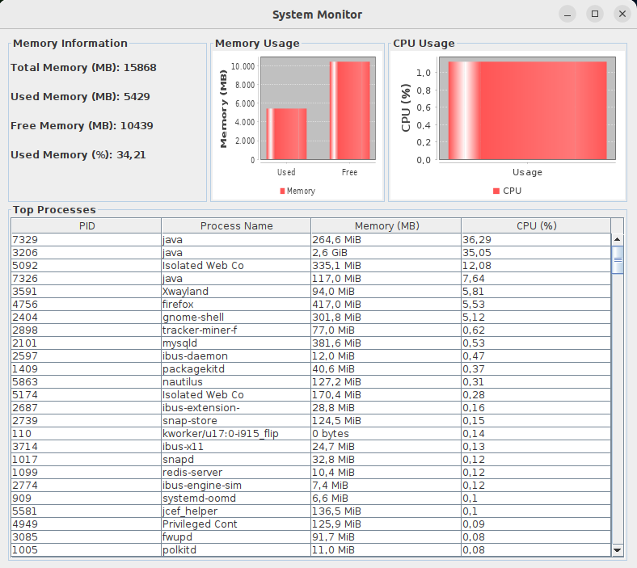

# System Monitoring System (Java MVC)

This Java and Swing-based system monitoring application, following the Model-View-Controller (MVC) architectural pattern, provides users with a comprehensive and real-time view of system performance. It allows monitoring system memory usage, CPU usage, and processes through an intuitive graphical interface. Users can track memory allocation patterns, optimize CPU resource usage, and identify resource-intensive processes for efficient system management. Designed for usability, it offers real-time updates and dynamic graphs, ensuring a smooth monitoring experience. In summary, this application offers a powerful solution for monitoring and optimizing system performance, facilitating efficient and reliable system operation.

## Project Structure

The project is organized into three main packages:

- **org.example.controller:** Contains classes responsible for the system's control logic.
- **org.example.model:** Contains classes representing the system's data model.
- **org.example.view:** Contains classes responsible for the user interface.

## Technologies used

1. Java: As the main programming language, Java offers portability and wide adoption, making it a popular choice for desktop applications.

2. Swing: This GUI library for Java provides a variety of graphical components for creating intuitive and interactive user interfaces.

3. Model-View-Controller (MVC): The MVC architectural pattern is used to separate the components of the application into three main parts: Model, View, and Controller. This helps organize the code, improving the maintenance and extensibility of the application.

4. JFreeChart: This Java library allows for programmatically creating charts. In the system monitoring application, JFreeChart is used to display bar charts representing CPU and memory usage.

5. oshi: A Java library for accessing operating system information, such as memory usage, CPU load, and details of running processes. oshi provides valuable data for monitoring real-time system performance.

## System Requirements

To run the system, you need the following:

- JDK (Java Development Kit) installed.
- OSHI library for system information. (The dependency can be included in the Maven project or downloaded manually.)

## How to Run

1. Clone the repository to your local machine:

   git clone <REPOSITORY_URL>

2. Open the project in your favorite Java IDE.

3. Run the `org.example.controller.SystemController` class to start the application.

## Features

The system offers the following features:

- **Real-time Monitoring:** Continuous updates on memory usage, CPU usage, and system processes.
- **Graphical Views:** Bar charts representing memory and CPU usage.
- **Process Table:** Lists major running processes, displaying information such as PID, process name, memory usage, and CPU usage.
- **System Information:** Displays detailed information about total memory, used memory, free memory, and percentage of memory used.

